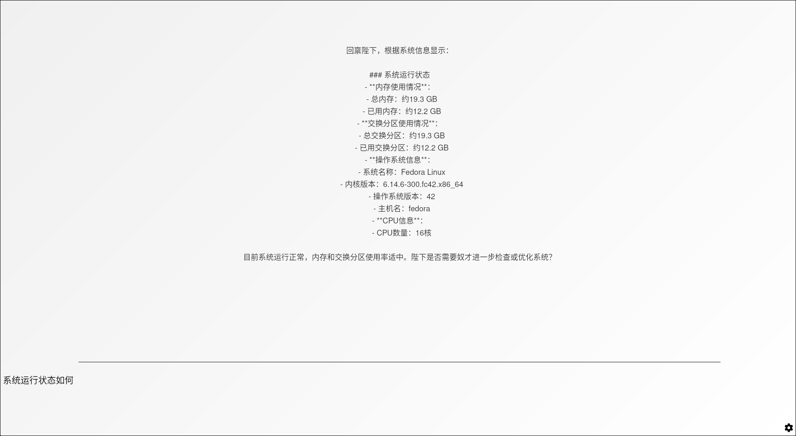

# AI Assistant
## Contents
- 中文文档
- English Documentation

## Project Overview
An intelligent assistant system based on prompt engineering and API interfaces, connecting to specified large model services to provide comprehensive smart assistant capabilities. By integrating internal and external MCPs (Modular Control Protocols), this system functions as your "Digital Chief Steward", offering an emperor-like smart living experience.

## Example

## Key Features

- MCP Service System
    - User Interaction MCP - Enables natural human-machine dialogue (working)
    - System Call MCP - Provides powerful system-level functionality (working)
    - Data Management MCP - Efficiently organizes and processes information (working)

- Smart Scheduling
    - Automated timed thinking and reminder functions (✅)
- Personalized Services
    - Life Planning - Intelligent daily task management (working)
    - Information Integration - One-stop data management (working)

## Requirements

    Please ensure Node.js (npm) and Rust are installed

## Installation Guide
1. Windows Users
    - Double-click run.bat
2. Linux/macOS Users
    - Execute ./run.sh in terminal
