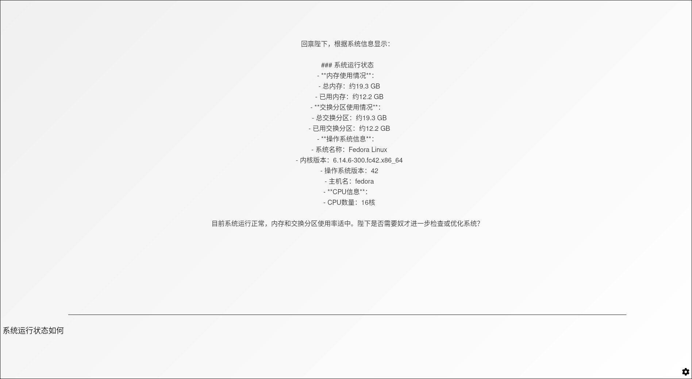

# AI 大内总管
## 目录
- [中文 README](README.md)
- [English README](README-EN.md)

## 项目简介
一款基于提示词工程和 API 接口的智能助手系统，通过连接指定地址的大模型服务，为用户提供全方位的智能助理服务。通过整合内部和外部 MCP（模块化控制协议），将本系统打造成为您的"数字大内总管"，让您享受帝王般的智能生活体验。

## 效果示例

## 核心功能

- MCP 服务体系
    - 用户交互 MCP - 提供日常对话功能[✅]
    - 系统调用 MCP - 通过内置的方式给 AI 添加控制系统的能力 [施工中]，已添加：
      1. 系统通知功能 [✅]
      2. 在工作目录的文件读写功能 [✅]
    - 数据管理 MCP - 作为秘书管理系统上的文档数据 [施工中]
- 智能定时任务
    - 自动化的定时思考与提醒功能，通过阅读代办、日程等自主完成一些事物 [施工中]
- 个性化角色服务
    - 角色自定义 - 通过角色卡设置不同的角色体验 [✅]
    - 生活规划 - 智能安排日常事务 [施工中]
    - 信息整合 - 一站式管理各类数据 [施工中]
    - AI 自治 - 让主 AI 人格管理余下其它角色，实现内部 AI 生态圈 [施工中]，已添加：
      1. 角色的删除、创建 [✅]
      2. 主人格与角色的对话 [✅]

## 环境要求
    请确保已安装 Node.js (npm) 和 Rust 环境

## 安装指南
1. Windows 用户
    - 双击运行 run.bat
2. Linux/macOS 用户
    - 在终端执行 ./run.sh
